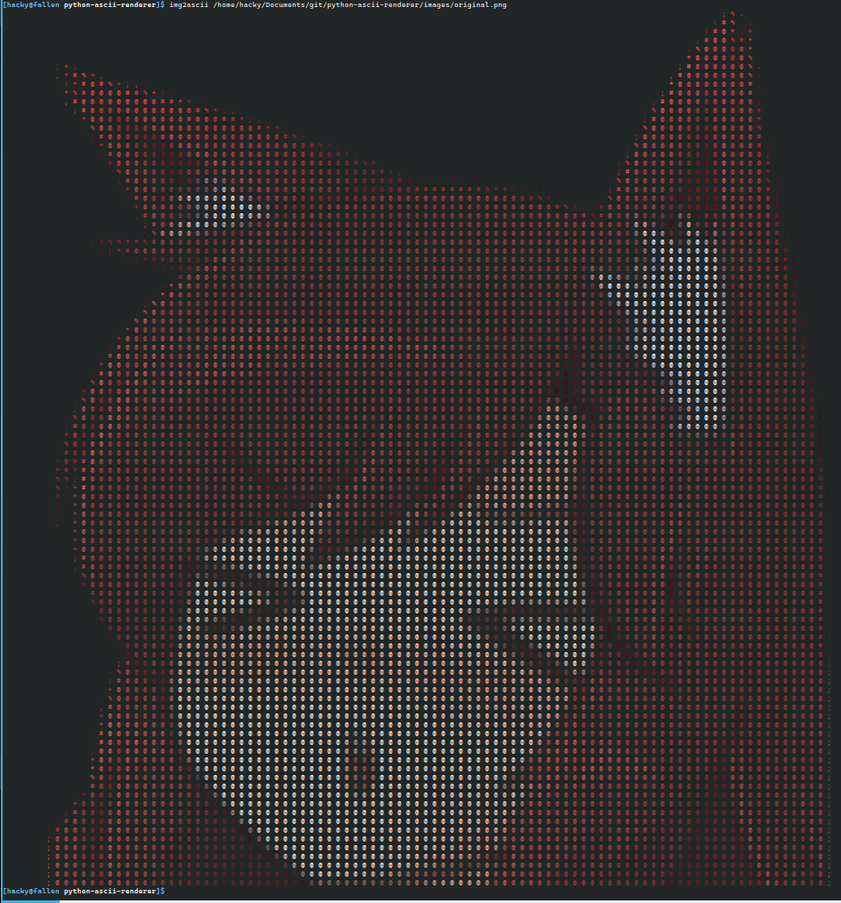

# python-ascii-renderer
This Python script just takes an image, resizes it, and converts it to colored ASCII. Beware, it relies on truecolor support.

## Preview
Image obtained from: https://emoji.gg/emoji/6898-awoo  
[](https://github.com/H4CKY54CK/python-ascii-renderer/blob/main/images/original.png)  
[](https://github.com/H4CKY54CK/python-ascii-renderer/blob/main/images/preview.png)  

## Usage (Needs Rewritten)
```
usage: img2ascii.py [--timeout N] [--chars ABC] [--out FILE] [--width X | --height Y | --size X Y] [--fg | --no-fg] [--bg | --no-bg] [--force-size] [--quiet] [--help] source

Positional Arguments:
  source               Either the path to an image on disk or a URL that points to the image.

Options:
  --timeout N, -T N    Set the max timeout in seconds for requesting a URL. Ignored otherwise. (Default: 3)
  --chars ABC, -C ABC  The character set to use for the varying levels of pixel brightness.
  --out FILE, -o FILE  Instead of writing to stdout, dump to the provided file (WILL OVERWRITE EXISTING FILE).

Size Options:
  --width X, -x X      Force width to X, preserving aspect ratio. This is useful for ensuring that the final ASCII rendition will fit within a given width.
  --height Y, -y Y     Force height to Y, preserving aspect ratio. This is useful for ensuring that the final ASCII rendition will fit within a given height.
  --size X Y           Resize the image to X width by Y height, preserving aspect ratio. If you need to resize while NOT preserving the aspect ratio, add the boolean option --force-size.

True/False Flags:
  --fg, --no-fg        Whether to use the pixel colors in the foreground of the ASCII. (Default: True)
  --bg, --no-bg        Whether to use the pixel colors in the background of the ASCII. (Default: False)
  --force-size         This forces the image to be resized without any regard to aspect ratio. (Yes, this will squash your image. If it were perfectly square, you wouldn't need to to do this.).
  --quiet, -q          Do not print anything to stdout (Default: False).
  --help, -h           Show this help message and exit.
```

## A few notes
There might be some unused variables even though I gave it a once-over before pushing this to the repo. When (not if) you find something incorrect, feel free to mention it. I just may not prioritize a fix, since nobody is really relying on this for anything.